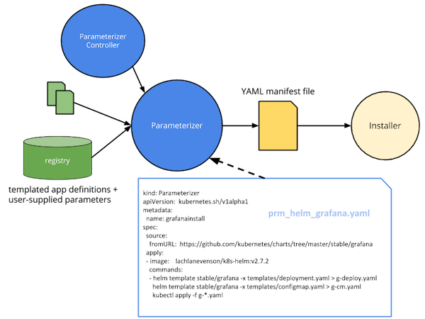

# Parameterizer

`Parameterizer` is a command line tool and Kubernetes operator for handling application lifecycle management, generically.

Just like `Ingress` allows to generically define how traffic is routed to Kubernetes services, with different backends (NGINX, HAProxy) providing the functionality, the `Parameterizer` resource defines a sequence of commands applied to an app definition input (directory or registry such as [Quay.io](https://quay.io/application/) or [Kubestack](https://www.kubestack.com/)), turning Kubernetes application definitions (e.g. expressed in [Helm templates](https://github.com/kubernetes/helm/blob/master/docs/chart_template_guide/functions_and_pipelines.md), [ksonnet](https://ksonnet.io/docs/concepts), [kapitan](https://github.com/deepmind/kapitan), etc.) along with user-defined parameters into a parameterized Kubernetes YAML manifest.

This parameterized YAML manifest defines the necessary deployments, services, etc. for the app and can, for example, be used in a `kubectl apply` command to create the resources or via Helms' [Tiller](https://docs.helm.sh/glossary/#tiller), [appr](https://github.com/app-registry/appr), or other installers/ALM tools.

The overall `Parameterizer` architecture is as follows:

## Install

TBD

## Use

TBD
